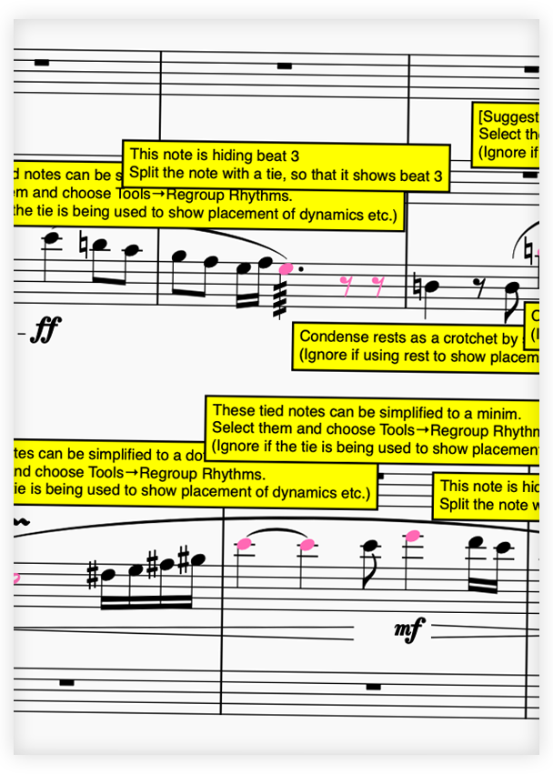

# MN Better Notation Plugins for MuseScore

A set of plug-ins for [MuseScore Studio 4.4](https://musescore.org/en) that check your scores for common notation and layout issues.

  

    <a href="#includedplugins">Included Plugins</a> •
    <a href="#installation">Installation</a> •
    <a href="#permission-request">Permission Request</a> •
    <a href="#contributing">Contributing</a> •
    <a href="#languages">Languages</a> •
    <a href="#license">License</a>
  

  
  

## Included plug-ins

###  MN CHECK RHYTHMIC NOTATION

* **MN Check Rhythmic Notation** checks for:
  * Notes incorrectly 'hiding' a beat (with standard exceptions)
  * Overspecified tied notes that can be 'condensed' into a single note
  * Overspecified rests that can be 'condensed' into a single rest
  * Bar rests incorrectly entered manually
  * Notes not beamed together correctly
  * Notes incorrectly beamed together

***

###  MN CHECK LAYOUT AND INSTRUMENTATION

* **MN Check Layout & Instrumentation** checks for over 60 different layout, notation and instrumentation problems, such as:
  * **Spacing and layout**: inappropriate staff size, inappropriate margins, barline width too thick, bar spacing too wide or too narrow, minimum bar width too small, inappropriate spacing ratio
  * **Staff names and order**: non-standard staff names, non-standard staff name visibility, incorrect staff order, duplicate staff names
  * **Fonts and styles**: inappropiate tuplets font, incorrectly styled text, incorrect dynamics font
  * **Dynamics**: missing first dynamic, redundant dynamics, long hairpins not ‘terminated’, incorrect location for dynamics, dynamic needing restating after long rest
  * **Text objects**: common misspellings, incorrectly capitalised text, space or non-alphanumeric character at start, text could be abbreviated, incorrect location for expressions, straight quotes instead of curly, tempo marking but not entered in Tempo text, default text in Project Properties not changed
  * **Orchestral parts issues**: single line on shared wind/brass staff lacking ‘a 2’/‘1.’ marking; string part lacking a ‘unis.’/‘div.’ marking
  * **String-specific issues**: redundant arco/pizz./col legno/tasto/pont/ord. markings, passage that looks arco but is marked pizz., incorrect notation for string harmonics, string harmonic does not exist, artificial harmonic interval incorrect, long pizz. notes, staccato pizz. notes
  * **Harp-specific issues**: double flats/sharps, impossible chords, too many notes in a chord, too many quick pedal changes
  * **Instrument-specific issues**: redundant mute indications, piano stretches too wide, flute harmonics incorrectly notated, fluttertongue incorrectly notated
  * **Pitch**: incorrect use of clefs, clef change needed, incorrect use of 8va/8vb, 8va/8vb needed
  * **Key signatures**: extreme key signatures (6 or more sharps/flats), rapid key signature change, redundant key signature change
  * **Time signatures**: missing first time signature, redundant time signatures
  * **Clefs**: instrument doesn’t read given clef, redundant clef, clef change would improve readability
  * **Slurs**: slurs incorrectly begin/end on tied note, repeated notes under a slur without articulation, slur used instead of tie, accented notes in middle of a slur, slurs over rests
  * **Omissions**: rehearsal marks (for longer conducted works), initial tempo marking, pedal indications on pedal instrument
  * **Other**: fermatas inconsistent or missing across parts, tremolos incorrectly written, incorrect notation of grace notes, stems incorrectly flipped, note tied to different pitch, pickup bars with inconsistent rests, transposing score not switched on, unnecessarily complex key signatures, short key signature changes, redundant time signature changes, staccato on dotted notes

***

###  MN CHECK ACCIDENTALS

* **MN Check Accidentals** checks for: 
  * **augmented and diminished intervals** preceded or followed by another augmented or diminished interval (often a sign that an accidental has been misspelled)
  * **double-sharps & double-flats** which may not be necessary
  * **extreme accidentals** (e.g. B# Cb E# Fb), accounting for key signature
  * **recommended courtesy accidentals**

## Installation

*MN Better Notation Plugins require MuseScore Studio 4.4 or later.*
* **Download** the project as a zip file either from the green Code button above, or from the direct download link below.
* **Extract it** using archive extraction software
* **Move the entire folder** into MuseScore’s plugins folder, configurable at [Preferences→General→Folders](https://musescore.org/en/handbook/4/preferences). The default directories are:
    * **Mac OS**: ~/Documents/MuseScore4/Plugins/
    * **Windows**: C:\Users\YourUserName\Documents\MuseScore4\Plugins\
    * **Linux**: ~/Documents/MuseScore4/Plugins
* **Open MuseScore** or quit and relaunch it if it was already open
* Click **Home→Plugins** or **Plugins→Manage plugins...**
* For each of the four MN plugins, click on their icon and click ‘**Enable**’
* The plugins should now be available from the **Plugins** menu

### Direct Download

Direct downloads of the Zip file can be found on the [releases page](https://github.com/mnorrisvuw/MN-Better-Notation-Plugins-for-MuseScore/releases).

## Use
* Select the passage you wish to check for errors, or, to check the whole score, either select all or have nothing selected. Then  select the name of the plugin you wish to run from the Plugins menu. *(If you can’t see the names of the plugins, check that you have enabled them — see installation instructions above)*

* Note that the *Check Layout and Instrumentation* plugin **always** checks the entire score, regardless of the current selection.

* The plugin will go through the selection/score looking for relevant issues. When it finds one, it will add a **yellow text box comment** on the score (somewhere close to the error), and will highlight the relevant notation object in pink. Once it has finished, it will present a dialog box telling you how many errors it found.

* **Note that the plugins do not fix the error themselves: that is up to you.**

* Sometimes these comments might be more of a suggestion rather than a hard-and-fast typesetting rule: you should therefore consider each comment carefully before remedying.

* It can be a good idea to delete each comment box as you fix the relevant issue to keep track of what you have done.

* If there are a lot of comments, sometimes a comment box can end up some distance away from the object it is referring to. If you can’t work out what a comment is referring to, click and drag the box around a bit: you will see an ‘attachment line’ that shows the location of the object to which it is referring.

* Each time you run a plugin, it will remove any previous comments or highlights.

* To manually remove all comments and highlights from a score, please run the ‘MN Delete Comments and Highlights’ plugin

* Some comments refer to a specific page in [*Behind Bars* by Elaine Gould](https://www.amazon.com.au/dp/0571514561). This is simply to provide a level of evidence behind some of my comments, in case you think them overly pedantic or plain wrong! 😄

## Warning about usage
* Note that these plugins use the styles of their comment boxes (yellow fill, black border) to distinguish them from normal text objects and highlights.

* As such, if you select ‘Format→Reset Text Style Overrides’ or ‘Format→Reset Entire Score to Default Layout’ while you still have comments on the score, MuseScore will revert them all to standard black-and-white text

* If this happens, the ‘MN Delete Comments and Highlights’ will not be able to detect them to delete them, and you will have to go through and manually delete each one.

* Therefore, it is recommended that you do not use these commands while there are still comments on your 

## Wait! Nothing happened!!!
* MuseScore does not currently have a way of providing any error messages to the user if it encounters a bug in the plugin code. Instead it just does nothing.

* If you do not get a ‘COMPLETION’ dialog box after running the plugin, it may mean that MuseScore encountered a bug.

* Please send the MuseScore file to Michael Norris, along with a description of which plugin you were running and (if it makes a difference) what portion of the score you had selected.

* If you are able to replicate the bug reliably, that is also very helpful

* That leads me to...

## Feedback, requests and bug reports

* I love feedback, feature requests and bug reports! ♥️

## Known bugs and limitations

**MN Check Layout & Instrumentation**

* Only checks the top staff of a harp part for issues
* Cannot check the title, subtitle or composer text for various text issues; this seems to be a limitation of the plugin architecture

**MN Check Rhythmic Notation**

* Ignores beaming of some time signatures that could be grouped in different ways
* Does not check for correct breaking of the 16th or 32nd beams

**MN Check Accidentals**

* Is not very intelligent about some of the extreme accidentals

## License

This project is licensed under the terms of the GNU General Public License v3.0.  
See [LICENSE](LICENSE) for details.
