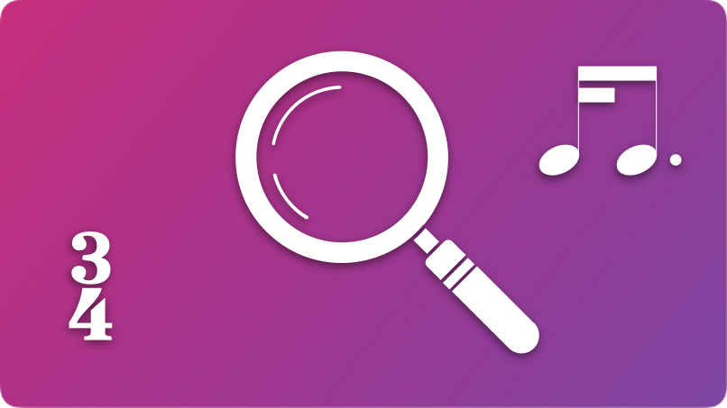

# MN Better Notation Plugins for MuseScore

A set of plug-ins for [MuseScore Studio 4.5](https://musescore.org/en) that assists in the creation of beautiful, player-friendly scores by providing over 160 different checks for common notation and layout issues, and providing easy ways to create title pages and automatically tweak your scores to look fantastic.

  

    <a href="#includedplugins">Included plug-ins</a> •
    <a href="#installation">Installation</a> •
    <a href="#fonts">Fonts</a> •
    <a href="#use">How to use</a> •
    <a href="#feedback">Feedback, requests and bug reports</a> •
    <a href="#knownbugs">Known bugs and limitations</a> •
    <a href="#license">License</a>
  

  
  
  

## Included plug-ins

* [**MN Check Rhythmic Notation**](#plugin1)
* [**MN Check Layout and Instrumentation**](#plugin2)
* [**MN Check Accidentals**](#plugin3)
* [**MN Create Title Page**](#plugin4)
* [**MN Make Recommended Layout Changes**](#plugin5)
* **MN Delete Comments and Highlights**
***

###  MN CHECK RHYTHMIC NOTATION

* **MN Check Rhythmic Notation** checks for:
  * Notes incorrectly 'hiding' a beat (with standard exceptions)
  * Overspecified tied notes that can be 'condensed' into a single note
  * Overspecified rests that can be 'condensed' into a single rest
  * Bar rests incorrectly entered manually
  * Notes not beamed together correctly
  * Notes incorrectly beamed together
  * Notes that might be better written as staccato
  * Rests that might be better written to show the metre
  * Non-standard tuplets that require the ratio to be shown
  * Overly complex or misleading tuplets

***

###  MN CHECK LAYOUT AND INSTRUMENTATION

* **MN Check Layout & Instrumentation** checks for over 150 different layout, notation and instrumentation problems, such as:
  * **Spacing and layout**: inappropriate staff size, inappropriate margins, barline width too thick, bar spacing too wide or too narrow, minimum bar width too small, inappropriate spacing ratio, note spacing too wide or narrow, some style settings not optimal, bar number on first bar, staff spacing not optimal, system spacing not optimal, page size not A3 or A4, last system not finishing in bottom right-hand corner of page, barlines not going through all staves of standard small ensemble, stretch factors applied inappropriately, no title page for work longer than 2 pages, name of work missing from first page of music, subtitle missing for solo works, non-optimal page layout settings for the parts
  * **Staff names and order**: non-standard staff names, missing staff names, non-standard staff name visibility, incorrect staff order, duplicate staff names
  * **Fonts and styles**: non-optimal tuplets font, incorrectly styled text, incorrect dynamics font, non-optimal page number font, tempo size too small 
  * **Dynamics**: missing first dynamic, redundant dynamics, long hairpins not ‘terminated’, incorrect location for dynamics, dynamic needing restating after long rest, ‘dim.’/‘cresc.’ used instead of hairpins, long passages without dynamics, dynamics or hairpins placed under a rest, hairpins dragged away from their correct location
  * **Tempo markings**: tempo marking not entered in Tempo text, rit./accel. without a terminating metronome mark/tempo indication/a tempo/tempo primo, tempo marking too large, metronome marking in bold, tempo marking not in bold, missing tempo marking, ‘approx.’ rather than ‘c.’, redundant (repeated) metronome marks, two rits or accels in a row without an intervening tempo marking, unnecessary parentheses in metronome marking, opening metronome marking without a ‘mood descriptor’
  * **Text objects**: common misspellings, incorrectly capitalised text, space or non-alphanumeric character at start, text could be abbreviated, incorrect location for expressions, straight quotes instead of curly, default title/subtitle/composer not changed, techniques placed over rests
  * **Rehearsal marks**: missing rehearsal marks, rehearsal marks placed in first two bars, rehearsal marks out of sequence
  * **Vocal music**: notes lacking lyrics, notes lacking melismatic extensions, melismata lacking slurs, multiple syllables under one slur, correct positioning of dynamics
  * **Orchestral parts issues**: monophonic line on a shared wind/brass staff missing player indication (e.g. 1./a 2 etc.); monophonic orchestral string part lacking ‘unis.’ after ‘div.’ marking
  * **String-specific issues**: redundant arco/pizz./col legno/tasto/pont/ord. markings, passage that looks arco but is marked pizz., incorrect notation for string harmonics, string harmonic does not exist, artificial harmonic interval incorrect, overly long slurs, long pizz. notes, staccato pizz. notes, slurs that may be too long for one bow stroke, fingered tremolos not slurred, bowed tremolos slurred, multiple-stops where two notes have to be played on the same string, triple- or quadruple-stops written with all strings sustained, potentially impossible double-stops, difficult passages of fast multiple-stops, slurs that are too long for stated dynamic, inappropriate slurred staccato, artificial harmonics too high, incorrect fluttertounge notation, queries potentially unnecessary isolated bow markings, bow markings in non-string instruments, harmonics written with both diamond noteheads and harmonic circles
  * **Harp-specific issues**: double flats/sharps, impossible chords, too many notes in a chord, too many quick pedal changes, slurred staccato
  * **Instrument-specific issues**: redundant mute indications, piano stretches too wide, flute harmonics incorrectly notated, fluttertongue incorrectly notated, flags dynamics that may be inappropriate for certain registers, flags notes that may be out-of-range or requiring a professional, missing pedal markings, multiple full pedal markings in a row (that could just be retakes), smooth or wiggly glissandi used incorrectly, trombone glisses impossible, polyphony in monophonic instrument, long notes on drums without trill/tremolo, staccato dots on drums, clef changes in harp/marimba, redundant vibrato markings
  * **Pitch**: incorrect use of clefs, clef change needed, incorrect or unnecessary use of 8va/8vb, 8va/8vb needed, horn written in bass clef unnecessarily
  * **Key signatures**: extreme key signatures (6 or more sharps/flats), rapid key signature change, redundant key signature change
  * **Time signatures**: missing first time signature, redundant time signatures
  * **Clefs**: instrument doesn’t read given clef, redundant clef, clef change would improve readability
  * **Slurs**: slurs incorrectly begin/end on tied note, repeated notes under a slur without articulation, slur used instead of tie, accented notes in middle of a slur, slurs over rests, slurs within slurs, slurs attached to the same note, long passages without slurs or articulation, slurs entered manually rather than automatically, slurs dragged away from their automatic position, slurs missing from two-note tremolos
  * **Other**: fermatas inconsistent or missing across parts, tremolos incorrectly written, incorrect notation of grace notes, stems incorrectly flipped, note tied to different pitch, pickup bars with inconsistent rests, transposing score not switched on, unnecessarily complex key signatures, short key signature changes, redundant time signature changes, staccato on dotted notes, ties across rests, identical chords with some but not all notes tied, beams manually dragged away from default position, double staccatos, tremolos with staccatos, harmonics without harmonic circles on tied notes, arpeggios with unnecessary up arrows, noteheads manually flipped direction, glissandi between notes of the same pitch

***

###  MN CHECK ACCIDENTALS

* **MN Check Accidentals** checks for: 
  * **augmented and diminished intervals** preceded or followed by another augmented or diminished interval (often a sign that an accidental has been misspelled)
  * **double-sharps & double-flats** which may not be necessary
  * **extreme accidentals** (e.g. B# Cb E# Fb), accounting for key signature
  * **unnecessary accidentals**
  * **recommended courtesy accidentals**
  * **preferred chromatic ascent/descent spelling**

***

###  MN CREATE TITLE PAGE
* **MN Create Title Page** automatically creates a professional-looking title page from the Title, Subtitle and Composer information entered on your score
* It lets you choose from a number of different templates/styles, many of which have been loosely modelled on professional music publishers’ house styles.
* **MN Create Title Page** will also, if required, automatically create a ‘front matter page’, with boilerplate text entered for you to populate (e.g. programme note, performance notes, instrumentation, etc.)
* **NOTE**: the bundled templates require commonly available fonts. Many of these fonts come with Mac OS X and/or Windows, or are installed by Microsoft Office. Some may need to be manually installed. See below for links to font downloads.

***

###  MN MAKE RECOMMENDED LAYOUT CHANGES

* **MN Make Recommended Layout Changes** automatically applies some key layout settings, as recommended by composer Michael Norris, such as:
  * **Spacing and layout**: staff size (based on the number of instruments), page margins, barline width, minimum bar width, spacing ratio, some style settings not optimal, bar number on first bar, staff spacing, system spacing, removes any manually added layout breaks, first system indentation
  * **Parts**: staff size (based on the number of instruments), page margins, barline width, minimum bar width, spacing ratio, some style settings not optimal, bar number on first bar, staff spacing, system spacing, first system indentation, multimeasure rests, multirest width
  * **Staff names and order**: Sets staff name visibility appropriate to ensemble size
  * **Fonts**: sets music font to Bravura, sets all tuplet, bar number, technique, expression font to Times New Roman, part name frame and padding, page number style to plain
  * **Other**: slur line width, title frame height and distance to music
***

## Installation

*MN Better Notation Plugins require MuseScore Studio 4.5.2 or later.*

**YOUTUBE**: Watch [a YouTube video](https://www.youtube.com/watch?v=TztQKb71Rw8) on how to install the plugins.

**INSTRUCTIONS**:
* **Download** the project as a zip file either from the green Code button above, or from the direct download link below.
* **Extract it** using archive extraction software
* **Copy and paste (or move) the entire folder** into MuseScore’s plugins folder, configurable at [Preferences→General→Folders](https://musescore.org/en/handbook/4/preferences). The default directories are:
    * **Mac OS**: ~/Documents/MuseScore4/Plugins/
    * **Windows**: C:\Users\YourUserName\Documents\MuseScore4\Plugins\
    * **Linux**: ~/Documents/MuseScore4/Plugins
* **Open MuseScore** or quit and relaunch it if it was already open
* Click **Home→Plugins** or **Plugins→Manage plugins...**
* For each of the four MN plugins, click on their icon and click ‘**Enable**’
* The plugins should now be available from the **Plugins** menu

## Installing fonts:
The templates in the **MN Create Title Page** plugin use the following freely available fonts. Many of these fonts come bundled with the Windows and/or Mac OS operating systems; all are available as a free download.

Depending on your particular combination of OS and other software, you may or may not already have them installed. If you need to install them, below is a list of download links:
* **Academy Engraved LET**: bundled with Mac OS X; available for download [here](https://fontsgeek.com/fonts/Academy-Engraved-LET-Plain)
* **Alegreya Sans**: available for download [here](https://fonts.google.com/specimen/Alegreya+Sans)
* **Amulya**: available for download [here](https://www.fontshare.com/fonts/amulya)
* **Aptos**: bundled with Windows and Microsoft products; the latest available for download [here](https://www.microsoft.com/en-us/download/details.aspx?id=106087)
* **Archivo**: available for download [here](https://www.fontshare.com/fonts/archivo)
* **Avenir**: bundled with Mac OS X; available for download [here](https://www.dafontfree.io/avenir-font/)
* **Baskerville**: bundled with Mac OS X; Libre Baskerville, a very similar font, is available for download [here](https://fonts.google.com/specimen/Libre+Baskerville) — you will need to manually set the fonts to Libre Baskerville.
* **Bitter**: available for download [here](https://fonts.google.com/specimen/Bitter)
* **Bodoni Moda**: available for download [here](https://fonts.google.com/specimen/Bodoni+Moda)
* **Century Schoolbook**: bundled with Mac OS X; available for download [here](https://www.dafontfree.io/download/century-schoolbook/)
* **Chaparral Pro**: available for download [here](https://font.download/font/chaparral-pro)
* **Clash Display**: available for download [here](https://www.fontshare.com/fonts/clash-display)
* **Crimson Pro**: available for download [here](https://www.fontshare.com/fonts/crimson-pro)
* **EB Garamond**: available for download [here](https://fonts.google.com/specimen/EB+Garamond)
* **Fanwood Text**: available for download [here](https://www.theleagueofmoveabletype.com/fanwood)
* **Futura**: bundled with Mac OS X; available for download [here](https://www.dafontfree.io/futura-font-free/)
* **Gill Sans**: bundled with Max OS X and Windows 11; available for download [here](https://font.download/font/gill-sans-2)
* **Goudy Old Style**: bundled with Microsoft Office; available for download [here](https://font.download/font/goudy-old-style)
* **Helvetica Neue**: bundled with Mac OS X; available for download [here](https://font.download/font/helvetica-neue-5)
* **Linden Hill**: available for download [here](https://www.theleagueofmoveabletype.com/linden-hill)
* **Literata**: available for download [here](https://www.fontshare.com/fonts/literata)
* **Lucida Bright**: bundled with Microsoft Office; available for download [here](https://fontsgeek.com/fonts/Lucida-Bright-Regular)
* **Lulo Clean**: available for download [here](https://www.fontshmonts.com/display-fonts/lulo-clean/)
* **Optima**: bundled with Mac OS X; available for download [here](https://www.dafontfree.io/optima-font/)
* **Palatino**: bundled with Mac OS X and Windows 11
* **Proxima Nova**: bundled with Mac OS X; available for download [here](https://www.dafontfree.io/proxima-nova-font-free/)
* **Rockwell**: bundled with Mac OS X; available for download [here](https://freefontsfamily.org/rockwell-font-free/)
* **Satoshi**: available for download [here](https://www.fontshare.com/fonts/satoshi)
* **Supreme**: available for download [here](https://www.fontshare.com/fonts/supreme)
* **U001Con**: available for download [here](https://fontlibrary.org/en/font/u001)
* **Work Sans**: available for download [here](https://open-foundry.com/fonts/work_sans_light)

### Direct Download

Direct downloads of the Zip file can be found on the [releases page](https://github.com/mnorrisvuw/MN-Better-Notation-Plugins-for-MuseScore/releases).

## How to use
* **MN Create Title Page**: 
    * Before running this plug-in, make sure you have the default box (‘vertical frame’) at the top of your first page of music with the correct title, subtitle (e.g. ‘for string quartet’) and your/the composer’s name. The plug-in will use this information to create a new, styled title page.
    * Adding an image can be another nice touch. Once you’ve created your title page, right-click anywhere in the title page frame and choose Add→Image, then select an image from your hard-drive. Once added, you’ll need to resize the image (in Properties) and drag it into the correct location.

* **MN Make Recommended Layout Changes**:
    * You can run this plug-in at any time; however, it’s recommended that you have added all of the instruments you will need, and have at least two systems of music entered.
    
* **MN Check Rhythmic Notation**,
**MN Check Layout and Instrumentation**,
**MN Check Accidentals**:
    * Select the passage you wish to check for errors, or, to check the whole score, either select all or have nothing selected. Then  select the name of the plugin you wish to run from the Plugins menu. *(If you can’t see the names of the plugins, check that you have enabled them — see installation instructions above)*

    * Note that the *Check Layout and Instrumentation* plugin **always** checks the entire score, regardless of the current selection.
    
    * The plugin will go through the selection/score looking for relevant issues. When it finds one, it will add a **yellow text box comment** on the score (somewhere close to the error), and will highlight the relevant notation object in pink. Once it has finished, it will present a dialog box telling you how many errors it found.
    
    * **Note that the plugins do not fix the error themselves: that is up to you.**
    
    * Sometimes these comments might be more of a suggestion rather than a hard-and-fast typesetting rule: you should therefore consider each comment carefully before remedying.
    
    * It can be a good idea to delete each comment box as you fix the relevant issue to keep track of what you have done.
    
    * If there are a lot of comments, sometimes a comment box can end up some distance away from the object it is referring to. If you can’t work out what a comment is referring to, click and drag the box around a bit: you will see an ‘attachment line’ that shows the location of the object to which it is referring.
    
    * Each time you run a plugin, it will remove any previous comments or highlights.
    
    * To manually remove all comments and highlights from a score, please run the ‘MN Delete Comments and Highlights’ plugin
    
    * Some comments refer to a specific page in [*Behind Bars* by Elaine Gould](https://www.amazon.com.au/dp/0571514561). This is simply to provide a level of evidence behind some of my comments, in case you think them overly pedantic or plain wrong! 😄

## Warning about usage
* Note that these plugins use the styles of their comment boxes (yellow fill, black border) to distinguish them from normal text objects and highlights.

* As such, if you select ‘Format→Reset Text Style Overrides’ or ‘Format→Reset Entire Score to Default Layout’ while you still have comments on the score, MuseScore will revert them all to standard black-and-white text

* If this happens, the ‘MN Delete Comments and Highlights’ will not be able to detect them to delete them, and you will have to go through and manually delete each one.

* Therefore, it is recommended that you do not use these commands while there are still comments on your score.

## Wait! Nothing happened!!!

* All of the plugins except ‘MN Delete Comments and Highlights’ show a dialog box titled ‘COMPLETION’ when they successfully complete their check of the score.

* However, if there is a bug in the plugin code that means it fails to successfully complete its checks, MuseScore does not currently have a way of letting the user know — instead it just does nothing and the dialog box does not show.

* **Therefore, if you do not get a ‘COMPLETION’ dialog box after running the plugin, it may mean that MuseScore encountered a bug and could not complete the code. If that happens...**

## Feedback, requests and bug reports

* Please send all feedback, feature requests and bug reports to michael.norris@vuw.ac.nz

* For bug reports, especially the ‘non-completion bugs’ mentioned above (i.e. the final dialog box does not show), **please send me your MuseScore file and the name of the plug-in.**

## Known bugs and limitations

**MN Check Layout & Instrumentation**

* For some checks such as dynamics under rests, the plugin will not check if the instrument is on a grand staff (future versions should be able to do this, it just requires a bit more code)
* Redundant dynamics check doesn’t yet check for *più* or *meno*

**MN Check Rhythmic Notation**

* Ignores beaming of some time signatures that could be grouped in different ways
* Does not check for correct breaking of the 16th or 32nd beams

**MN Check Accidentals**

* Is not very intelligent about some of the extreme accidentals

## License

This project is licensed under the terms of the GNU General Public License v3.0.  
See [LICENSE](LICENSE) for details.
